# はじめに

このマニュアルは、**shiire-kanri Web アプリ**（以下「アプリ」）を使う外注スタッフ向けの操作手引きです。仕入れた商品の採寸・撮影・出品・発送、そして月次の経費申請・報酬確認・請求書作成まで、一連の作業をすべて Web ブラウザから行えます。

:::tip
このマニュアルだけで通常業務はすべて完結します。困ったときは管理者まで連絡してください。
:::

**アプリURL:** https://shiire-kanri.nsdktts1030.workers.dev/

**動作環境:**
- Google Chrome / Safari（最新版推奨）
- スマホ・タブレット・PC すべて対応
- インターネット接続必須

---

# 初回ログイン手順

## ステップ 1: アプリの URL を開く

下記の URL をブラウザで開きます。ブックマークに入れておくと便利です。

```
https://shiire-kanri.nsdktts1030.workers.dev/
```

## ステップ 2: メールアドレスを入力

URL を開くと **Cloudflare Access のログイン画面** が表示されます。**管理者に登録してもらった Gmail アドレス** を入力して「Send me a code」をクリック。

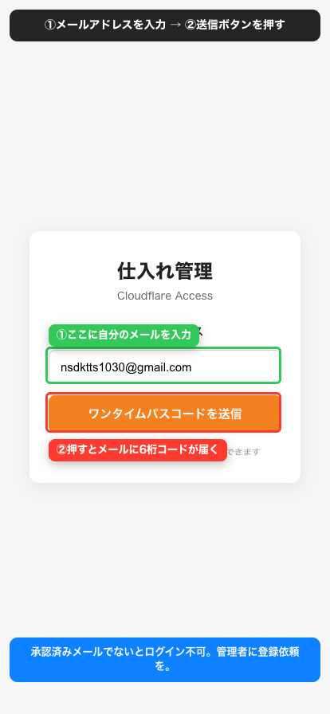

:::warn
登録されていないメールアドレスではログインできません。「Access denied」と出たら管理者に連絡してください。
:::

## ステップ 3: メールに届いた 6 桁コードを入力

入力した Gmail に **Cloudflare からの確認メール** が届きます。本文に記載された 6 桁のコードを画面に入力 → 「Sign in」をクリック。

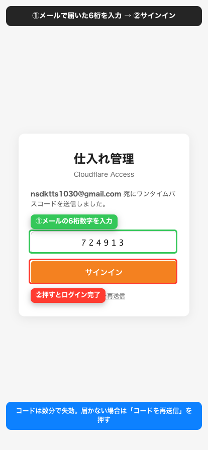

## ステップ 4: アプリ画面が開く

ログインに成功すると、左側にメニュー、右側に作業エリアが表示されます。

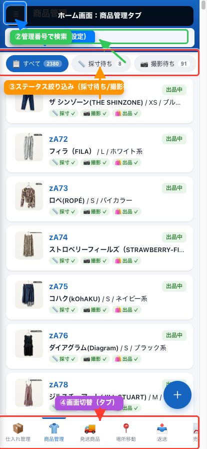

:::note
セッションは数日〜数週間有効です。一度ログインすれば毎回コードを入力する必要はありません。スマホ・PC・タブレットなどデバイスを変えるたびに再ログインが必要です。
:::

---

# 画面の基本構造

アプリの操作は **画面下部のボトムタブ** と **三本線メニュー（≡）の業務メニュー** から行います。

## ボトムタブ（画面下部）

画面下部に常に表示される 4 つのタブです。タップで切り替えます。それぞれの操作はこのマニュアルの章ごとに詳しく説明します。

| タブ | 用途 |
|---|---|
| 👕 商品管理 | 商品の基本情報・採寸・撮影・出品・販売情報の入力 |
| 🚚 発送商品 | 注文商品の発送状況の管理・完了日の付与 |
| 📍 場所移動 | 商品の置き場所の移動報告 |
| 📤 返送 | 不良返送・お客様返品の管理 |

## 業務メニュー（三本線メニュー）

画面左上の **三本線アイコン（≡）** をタップ／クリックすると業務メニューが開きます。経費申請・仕入れ数報告・報酬確認・各種設定はここから行います。

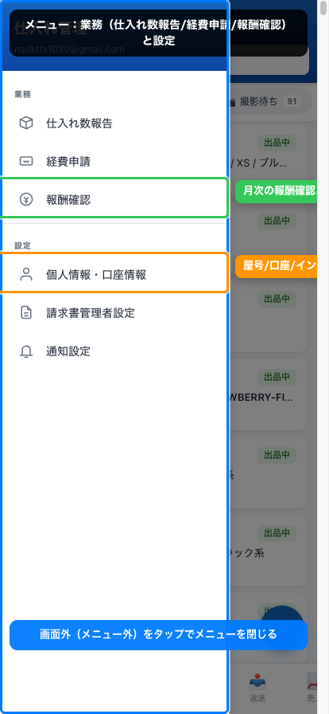

---

# 圏外・通信失敗時の動作（重要）

**結論: 圏外でもアプリの操作はすべて受け付けられます。** 採寸保存・経費申請・移動登録など、どんな操作も「成功しました」と表示されたらアプリ側で **責任を持って保存** し、通信が復帰したら自動で送信されます。

## 右下に「⏳ 未送信 N件」と出たとき

画面の右下に黄色いバッジが表示されることがあります。

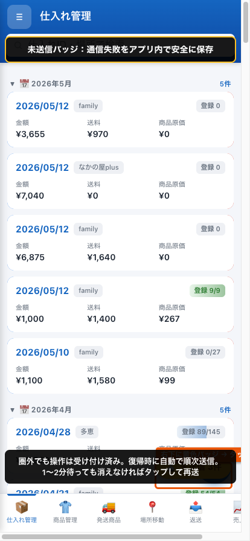

- これは **通信が失敗した操作がアプリ内に積まれている状態** です（=未送信キュー）
- スマホやアプリを閉じても消えません。次回アプリを開いた時に自動で送信を再試行します
- 圏外を抜けるか Wi-Fi に繋がると **自動で順番に送信** されます
- 1〜2 分待ってもバッジが消えない場合のみ、バッジをタップして次のいずれかを行ってください
  - **「今すぐ再送を試す」** ボタンで手動再送
  - 各項目の **「破棄」を 2 回タップ** すると個別に取り消し（スプレッドシートには反映されません）

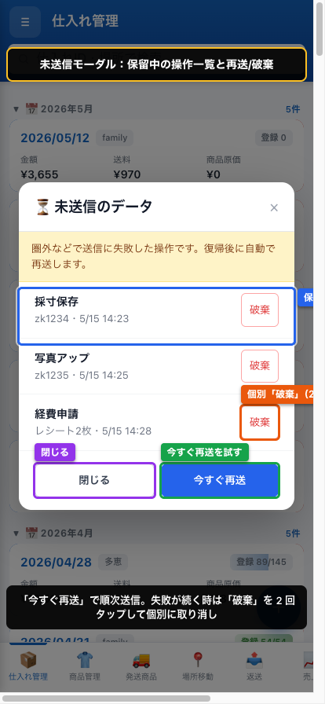

「破棄」は誤操作防止のため **2 回タップ** で確定します。1 回目タップで赤くアームされ、もう一度タップすると確定します。

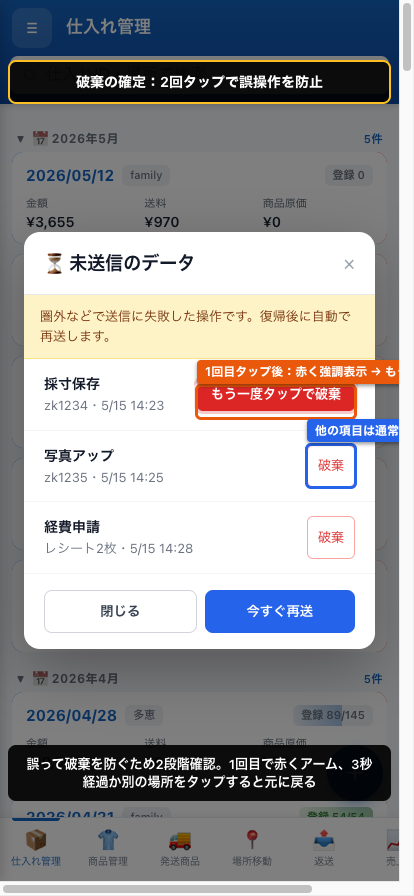

## やってはいけないこと

- 同じ操作を不安になって 2 回・3 回繰り返さなくて大丈夫です。サーバー側で **同じ内容の二重登録は自動でブロック** されます
- アプリを強制終了しても未送信は失われません

---

# 商品管理タブ

ボトムタブの **👕 商品管理** から開きます。すべての商品（管理番号単位）の一覧が表示されます。検索・フィルタで絞り込み可能です。

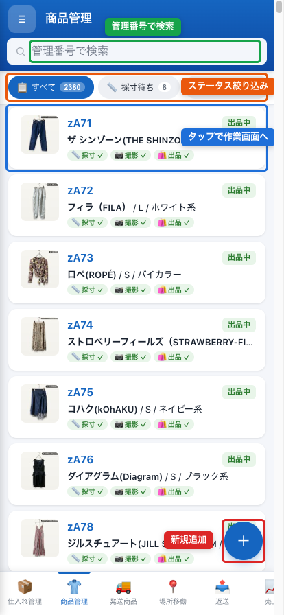

商品をタップすると **商品詳細画面** が開きます。詳細画面の上部には次の **6 つのセクションタブ** があり、タブを切り替えて作業内容ごとに入力します。

| セクションタブ | 主な内容 |
|---|---|
| 基本 | 商品の基本情報・仕入れ情報（読取専用） |
| 採寸 | 採寸数値・採寸記録 |
| 撮影・出品 | 撮影日・出品日・出品アカウント・出品リンク |
| 販売 | 販売情報・利益などの計算結果（読取専用） |
| 発送 | 発送日・発送関連画像・完了日 |
| 備考 | 備考・返品／廃棄記録 |

## 1. 基本タブ

商品の **基本情報** を入力します。

入力項目：ステータス・状態・ブランド・タグ表記・メルカリサイズ・性別・発送方法・カテゴリ1〜3・デザイン特徴・カラー・ポケット（有無／詳細）・透け感・伸縮性・生地の厚み・裏地・傷汚れ詳細 など

同じタブ内に **仕入れ日・仕入れ値・納品場所** も表示されます（仕入れ管理と連動した読取専用項目です）。

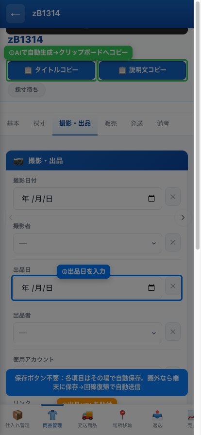

:::note
**基本情報の一部は、内部タスキ箱に商品写真を登録した時点で、AI 判定により自動入力されます。**
ブランド・カラー・カテゴリ・デザイン特徴などが自動で埋まっている場合があります。自動入力された内容は **必ず実物と照らし合わせて確認し、誤っていれば修正** してください。AI 判定はあくまで下書きです。
:::

## 2. 採寸タブ

各採寸項目に数値を入力します。

採寸項目：着丈・肩幅・身幅・袖丈・裄丈・総丈・ウエスト・股上・股下・ワタリ・裾幅・ヒップ など（カテゴリにより自動で項目が切り替わります）

採寸が終わったら **採寸日・採寸者** も記録します。

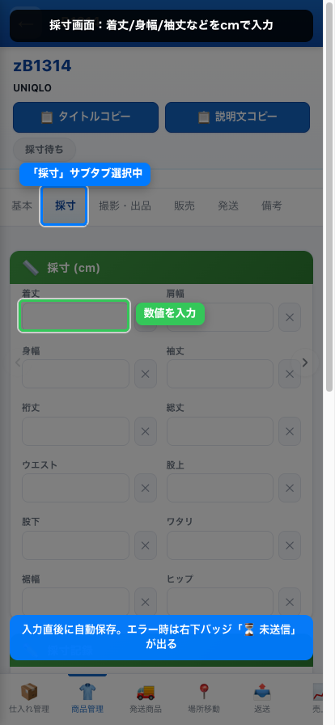

:::tip
タブ移動で次の項目に進めます。数値はそのまま入れて OK。単位は cm 固定です。
:::

## 3. 撮影・出品タブ

撮影・出品に関する記録を入力します。

**入力する項目：** 出品日・出品者・使用アカウント・リンク（出品ページの URL）

**自動入力される項目（入力不要）：** 撮影日付・撮影者

:::note
**撮影日付・撮影者は、内部タスキ箱に商品写真を登録した時点のデータが自動で入力されます。** スタッフが手入力する必要はありません。
:::

:::note
**商品写真そのものは、この管理アプリでは登録しません。** 写真の登録は **内部タスキ箱**（別の専用ツール）で行い、写真は 1 商品あたり **10 枚まで** です。このタブで入力するのは、出品の「日付・担当者・アカウント・リンク」などの記録です。
:::

## 4. 販売タブ

商品が売れたら販売情報を入力します。

入力項目：販売日・販売場所（メルカリ／BASE／ジモティ等）・プロモーション利用・販売価格・送料・手数料

入力すると **プロモーション手数料・粗利・利益・利益率・リードタイム・在庫日数** が自動計算され、読取専用で表示されます。

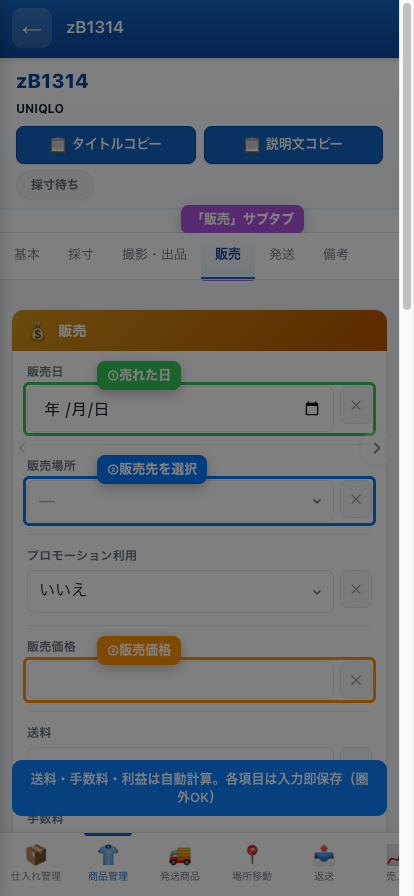

:::warn
販売情報の入力漏れがあると報酬計算に影響します。売れたら必ず当日中に入力してください。
:::

## 5. 発送タブ

発送に関する記録を入力します。

入力項目：発送日付・発送者・QR／バーコード画像・売却済み商品画像・ポストシール・完了日・キャンセル日

### 画像の登録方法

このタブには **3 つの画像欄** があります。

| 画像欄 | 登録する画像 |
|---|---|
| QR／バーコード画像 | 発送ラベルの QR コード・バーコード |
| 売却済み商品画像 | 発送する商品そのものの写真 |
| ポストシール | ポスト投函用シール（ネコポス等）の写真 |

各画像欄には次の **3 つの登録ボタン** があります。状況に応じて使い分けてください。

| ボタン | 動作 |
|---|---|
| 📷 カメラ | その場でカメラを起動して撮影し、登録します |
| 🖼 画像 | スマホ・PC に保存済みの画像を選んで登録します |
| 📋 貼り付け | コピー済みの画像を貼り付けて登録します（スクリーンショットは `Cmd + V` でも貼り付け可） |

**登録の手順:**
1. 登録したい画像欄の **📷 カメラ／🖼 画像／📋 貼り付け** のいずれかをタップ
2. 画像を選択／撮影すると、自動でアップロードされ、欄にプレビューが表示されます
3. 画像は **最大 1600px の JPG** に自動変換されて保存されます

:::tip
画像を登録し直したいときは、プレビュー右上の **✕ ボタン** で削除してから登録し直してください。
:::

:::note
発送済み商品への **完了日** のつけ方は、後述の「発送商品タブ」を参照してください。
:::

## 6. 備考タブ

その他の情報を記録します。

入力項目：備考（自由記入）・返品日付・廃棄日

---

# 発送商品タブ

ボトムタブの **🚚 発送商品** から開きます。注文が入った商品の発送状況を管理します。タブ上部のトグルで **発送待ち／発送済み** を切り替えて絞り込めます。

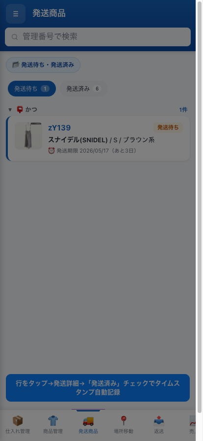

**フロー:**
1. 注文一覧から発送する商品を選択
2. 梱包・発送
3. 「発送済み」にチェック → タイムスタンプ自動記録

## 発送済み商品に完了日をつける（アカウント運用者）

発送が済んだ商品は、**アカウント運用者** が取引完了を確認したうえで **完了日** をつけます。

**手順:**
1. 発送商品タブ上部のトグルを **「発送済み」** に切り替える
2. 取引が完了した商品カードにある **「完了 ✓」ボタン** をタップ
3. 誤操作防止のため **3 秒以内にもう一度タップ** すると確定します
4. 完了日（タップした当日）がセットされ、カードが **「完了 ◯月◯日」** のバッジ表示に変わります


:::warn
完了日をつけられるのは発送済みの商品だけです。取引相手の受取が確認できてから押してください。
:::

:::note
完了日をセットすると、その商品のステータスは最終的に「完了」として扱われます。
:::

---

# 場所移動タブ

ボトムタブの **📍 場所移動** から開きます。商品が複数の納品場所（倉庫・店舗）に分散している場合に、どこに何があるかを管理します。

**できること:**
- 商品の場所移動を報告（移動先・管理番号を入力）
- 場所別の在庫一覧

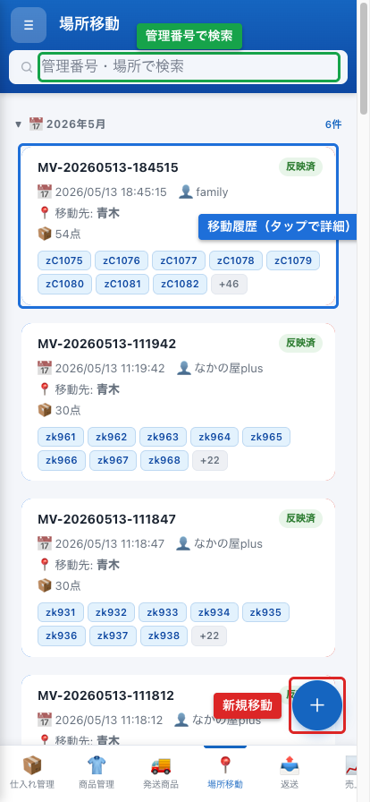

:::tip
移動報告は管理者側で自動的に商品管理シートに反映されます。スタッフは「報告するだけ」で OK です。
:::

---

# 返送タブ

ボトムタブの **📤 返送** から開きます。お客様返品・仕入先への返送など、返送箱単位で管理します。

**入力項目:**
- 箱 ID
- 移動先（店舗・お客様等）
- 管理番号
- 着数
- 備考
- 返送日

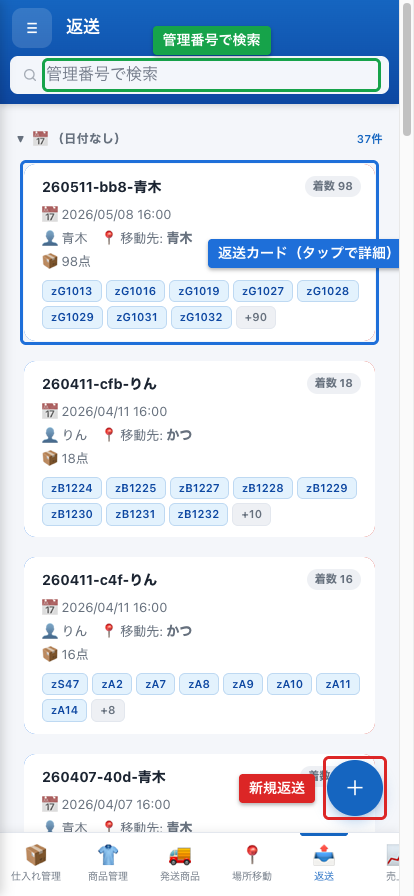

---

# 業務メニュー

業務メニューには次の 3 つの機能があります。

| 項目 | 用途 |
|---|---|
| 仕入れ数報告 | 入荷した商品の現物数量を報告 |
| 経費申請 | レシート画像を添付して経費申請 |
| 報酬確認 | 月次報酬の確認・請求書 PDF 作成 |

## 仕入れ数報告

管理者が「仕入れ報告」シートに登録した行に対して、外注スタッフが**実際の現物数量を入力**します。

**手順:**
1. 業務メニュー → 「仕入れ数報告」
2. 未処理の行が一覧表示される
3. 現物数を確認 → 数量入力 → 「保存」
4. 処理済みフラグが立ち、一覧から消える

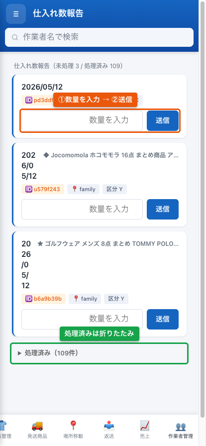

:::warn
数量入力は **一度確定すると元に戻せません**。慎重に数えてから入力してください。
:::

## 経費申請

業務に関連する支払い（梱包資材・送料の立替・ガソリン代等）の精算申請。

**手順:**
1. 業務メニュー → 「経費申請」
2. 「新規申請」ボタン
3. 各項目入力：
   - 購入日
   - 商品名（何を買ったか）
   - 購入場所（店名・サイト名）
   - 購入金額
   - 外注費（自分の作業代がある場合）
   - レシート画像をアップロード
4. 「送信」ボタン

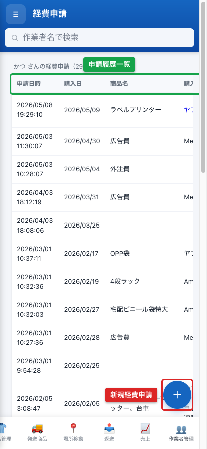

**申請履歴の確認:**

経費申請の画面には、これまでの申請履歴が一覧で表示されます。**自分が申請した分のみ**が表示され、他のスタッフの申請は見えません。

一覧の行をタップすると **詳細画面** が開き、その申請の全項目（申請日時・購入日・商品名・購入場所・購入金額・外注費・レシート画像など）をまとめて確認できます。

:::tip
レシート画像は必ず添付してください。画像がないと管理者が承認できません。
:::

:::note
申請内容は自動で管理者にメール通知されます。承認状況はこの画面で確認できます。
:::

## 報酬確認・請求書作成

毎月 20 日頃に、**前月分の請求書** を作成して管理者に提出します。

**手順:**

### ステップ 1: 月次報酬を確認

業務メニュー → 「報酬確認」 → **請求対象月**を選択（既定は前月）。

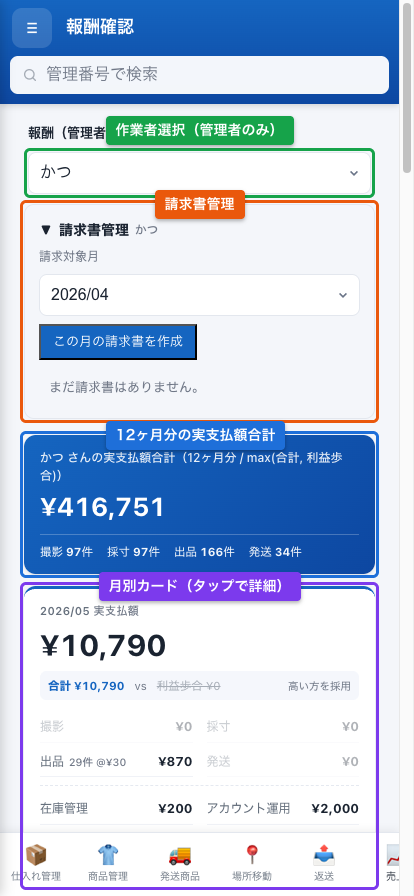

その月の作業件数・単価・税込合計・控除・調整・手数料・最終請求額が表示されます。

### ステップ 2: 詳細をチェック

「詳細」ボタンで内訳を確認。採寸何件・撮影何件・出品何件・発送何件・経費合計などが分かります。

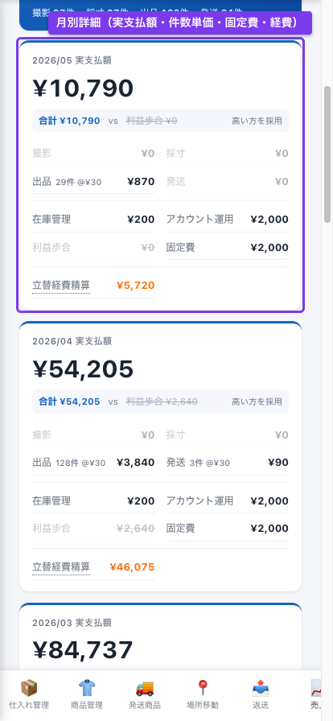

:::warn
数値に間違いがあれば、**この時点で「修正申請」**してください（後述）。
:::

### ステップ 3: 請求書プロフィール（初回のみ）

請求書発行には個人情報の登録が必要です。「請求書プロフィール」ボタンから次を入力：

- 屋号（任意）
- 本名
- 郵便番号・住所
- 電話番号
- 銀行名・支店名・口座種別・口座番号・口座名義
- インボイス登録番号（持っていれば）

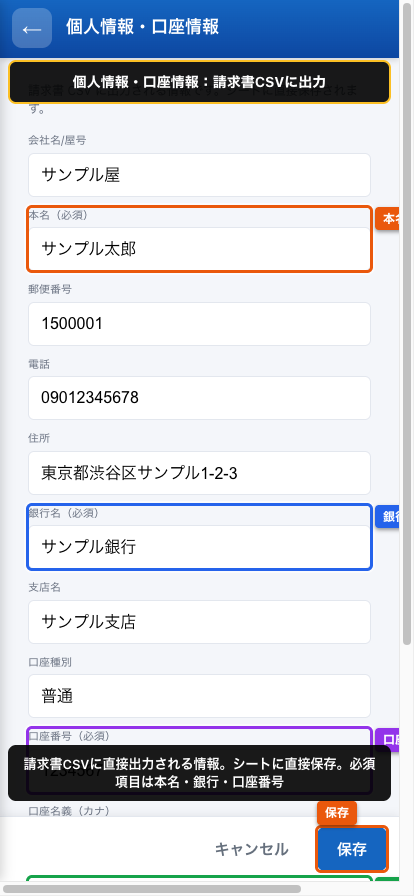

:::tip
インボイス登録番号がない場合も提出できますが、控除率が下がります（経過措置に従い段階的に減額）。
:::

### ステップ 4: 請求書を作成

詳細画面で「請求書を作成」ボタン → 確認ダイアログ → 「作成」。

請求書履歴に 1 行追加され、PDF が自動生成されます。

### ステップ 5: PDF をダウンロード

「PDF ダウンロード」ボタンで請求書 PDF を取得。

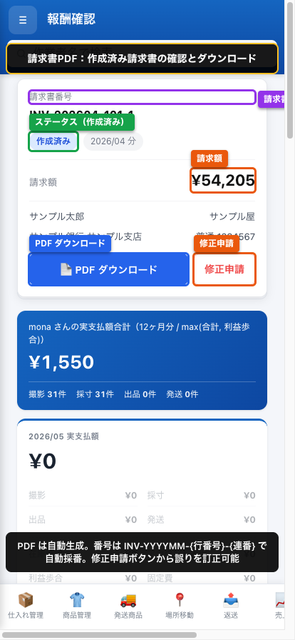

:::note
請求書番号は `INV-YYYYMM-{行番号}-{連番}` 形式で自動採番されます。
:::

### ステップ 6: 修正申請（必要な場合）

数値・件数・調整額などに誤りがあれば、「修正申請」ボタンから理由を添えて申請。

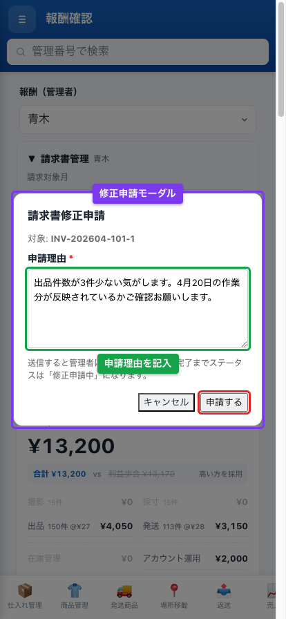

**ステータス遷移:**
- 未確認 → 確認済み → **修正申請中** → 修正承認済み → 作成済み → 支払済み（／取消済み）

申請後、管理者がメールで通知を受け取り、承認／却下／差戻しを行います。スタッフ側にもその結果がメールで届きます。

---

# よくある質問

## Q. ログインできない

- メールアドレスが管理者に登録されているか確認
- Cloudflare からのメールが迷惑メールに入っていないか確認
- それでもダメなら管理者に連絡

## Q. 商品写真はどこで登録する?

- 商品写真はこの管理アプリでは登録しません。**内部タスキ箱**（別の専用ツール）で登録します
- 写真は 1 商品あたり **10 枚まで** です

## Q. 右下の「⏳ 未送信 N件」バッジが消えない

- まず 1〜2 分待つ（自動で再送が走ります）
- それでも消えない場合はバッジをタップ→「今すぐ再送を試す」
- どうしても送れない項目は「破棄」を 2 回タップで個別取り消し可能（その操作はスプレッドシートに反映されません）

## Q. 同じ操作を 2 回押してしまった

- 心配ありません。サーバー側で **同じ内容の二重登録は自動でブロック** されるので、データは 1 件しか登録されません

## Q. 採寸データの保存ボタンが押せない

- 必須項目が空欄になっていないか確認
- 数字以外の文字が入っていないか確認

## Q. 請求書が作れない

- プロフィールが完全に入力されているか確認（特に銀行口座）
- 該当月の報酬データが「未集計」になっていないか確認（毎日 3 時に自動集計）

## Q. 報酬の集計が更新されていない

報酬集計は毎日 3 時に自動更新されます。**前日までの作業は当日 3 時以降に反映**されます。最新化が必要な場合は管理者に依頼してください。

## Q. 同じ月の請求書を 2 度作ったらどうなる?

- 既存の請求書が返されます（重複作成されません）
- 管理者が「取消」した後で再作成すると、連番（`-2`, `-3`, ...）が振られた新請求書が作成されます

---

# 連絡先

トラブル・要望・改善提案は **LINE で「かつ」まで** ご連絡ください。レスポンスは平日昼間がメインです。

:::tip
不明点はメモせず、その都度すぐに聞いてください。後から「やっぱり聞きたかった」となるよりも早めに解決した方がスムーズです。
:::
