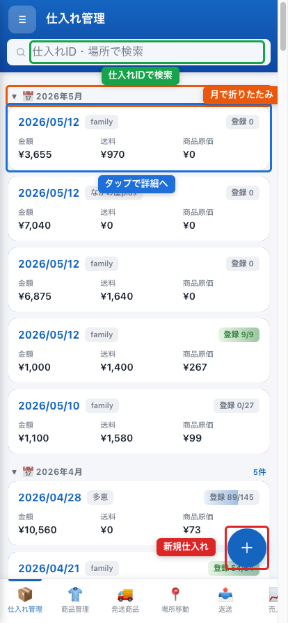
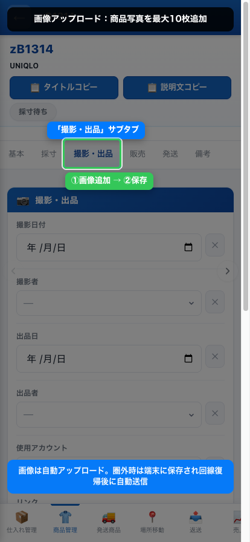
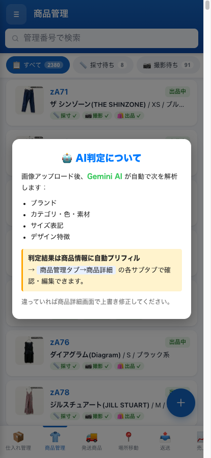
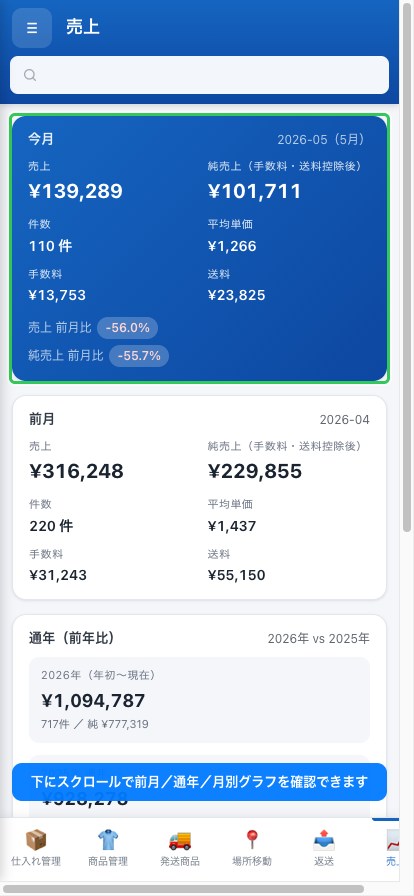
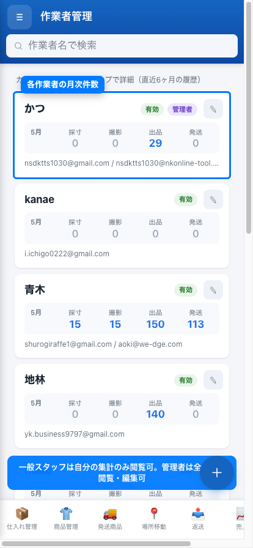

# はじめに

このマニュアルは、**shiire-kanri Web アプリ**（以下「アプリ」）を使う外注スタッフ向けの操作手引きです。仕入れた商品の採寸・撮影・出品・発送、そして月次の経費申請・報酬確認・請求書作成まで、一連の作業をすべて Web ブラウザから行えます。

:::tip
このマニュアルだけで通常業務はすべて完結します。困ったときは管理者まで連絡してください。
:::

**アプリURL:** https://shiire-kanri.nsdktts1030.workers.dev/

**動作環境:**
- Google Chrome / Safari（最新版推奨）
- スマホ・タブレット・PC すべて対応
- インターネット接続必須

---

# 初回ログイン手順

## ステップ 1: 管理者から URL を受け取る

管理者から下記の URL が共有されます。ブラウザのブックマークに入れておくと便利です。

```
https://shiire-kanri.nsdktts1030.workers.dev/
```

## ステップ 2: メールアドレスを入力

URL を開くと **Cloudflare Access のログイン画面** が表示されます。**管理者に登録してもらった Gmail アドレス** を入力して「Send me a code」をクリック。


:::warn
登録されていないメールアドレスではログインできません。「Access denied」と出たら管理者に連絡してください。
:::

## ステップ 3: メールに届いた 6 桁コードを入力

入力した Gmail に **Cloudflare からの確認メール** が届きます。本文に記載された 6 桁のコードを画面に入力 → 「Sign in」をクリック。


## ステップ 4: アプリ画面が開く

ログインに成功すると、左側にメニュー、右側に作業エリアが表示されます。


:::note
セッションは数日〜数週間有効です。一度ログインすれば毎回コードを入力する必要はありません。スマホ・PC・タブレットなどデバイスを変えるたびに再ログインが必要です。
:::

---

# 画面の基本構造

アプリは大きく **「商品管理メニュー」** と **「業務メニュー」** の 2 系統に分かれます。

| メニュー系統 | 主な内容 |
|---|---|
| 商品管理メニュー | 仕入れ商品の一覧表示・採寸・撮影・出品・発送・返送など |
| 業務メニュー | 経費申請、仕入れ数報告、報酬確認、請求書作成 |

画面左上の **三本線アイコン（≡）** をタップ／クリックするとメニューが開きます。


---

# 商品管理メニュー

商品管理メニューには次の 8 タブがあります。

| タブ名 | 用途 |
|---|---|
| 仕入れ管理 | 仕入れた商品の登録・確認 |
| 商品管理 | 採寸・撮影・出品・販売情報の編集 |
| 発送管理 | 発送状況の管理 |
| 納品場所 | 商品の置き場所・移動報告 |
| AI判定 | AI が自動判定した商品情報の確認 |
| 返送 | 不良返送・お客様返品の管理 |
| 売上 | 売上ダッシュボード |
| 作業者 | 作業者ごとの月次集計（管理者のみ閲覧可） |

## 仕入れ管理タブ

仕入れた商品 1 ロット（仕入れ単位）の一覧が表示されます。タップすると、その仕入れに含まれる個別商品（管理番号 `zkXXXX` 単位）が一覧表示されます。



**主な機能:**
- 仕入れ一覧の閲覧
- 個別商品一覧への遷移
- 仕入れ削除（管理者のみ・要注意）

## 商品管理タブ

すべての商品（管理番号単位）の一覧が表示されます。検索・フィルタで絞り込み可能です。


**できること:**

### 1. 採寸データ入力

商品をタップ → 「採寸」ボタン → 各項目に数値入力。

採寸項目：着丈・肩幅・身幅・袖丈・袖口幅・首回り・前股上・後股上・股下・ウエスト幅・もも幅・裾幅・ヒップ など（カテゴリにより自動で項目が切り替わります）


:::tip
タブ移動で次の項目に進めます。数値はそのまま入れて OK。単位は cm 固定です。
:::

### 2. 商品写真のアップロード

「画像追加」ボタン → スマホのカメラ／ライブラリから選択。同じ商品に複数枚アップ可能。



:::note
1 商品あたり 10 枚以上の画像をアップしても OK。AI 判定の精度は画像が多いほど上がります。
:::

### 3. 商品情報の編集

商品名・カテゴリ・ブランド・色・素材・状態・備考などを入力。AI 判定結果が自動入力されている場合は確認・必要に応じて修正します。


### 4. 販売情報の入力

商品が売れたら、販売日・販売場所（メルカリ／BASE／ジモティ等）・販売価格・送料・手数料を入力。


:::warn
販売情報の入力漏れがあると報酬計算に影響します。売れたら必ず当日中に入力してください。
:::

## 発送管理タブ

注文が入った商品の発送状況を管理します。発送済み／未発送のフィルタで絞り込み可能。


**フロー:**
1. 注文一覧から発送する商品を選択
2. 梱包・発送
3. 「発送済み」にチェック → タイムスタンプ自動記録

## 納品場所タブ

商品が複数倉庫に分散している場合に、どこに何があるかを管理。

**できること:**
- 商品の場所移動を報告（移動先・管理番号を入力）
- 場所別の在庫一覧


:::tip
移動報告は管理者側で自動的に商品管理シートに反映されます。スタッフは「報告するだけ」で OK です。
:::

## AI判定タブ

アップロードした画像を AI（Gemini）が解析し、ブランド・カテゴリ・色・素材・サイズ表記などを推定した結果一覧。



**使い方:**
- AI 判定結果は商品情報に自動でプリフィルされます
- 内容が違う場合は商品管理タブで上書き修正

## 返送タブ

お客様返品・仕入先への返送など、返送箱単位で管理。

**入力項目:**
- 箱 ID
- 移動先（店舗・お客様等）
- 管理番号
- 着数
- 備考
- 返送日


## 売上タブ

その月の売上・点数・チャネル別売上などをダッシュボード表示。



## 作業者タブ

各作業者の月次作業件数（採寸／撮影／出品／発送など）が表示されます。**管理者専用のタブ**ですが、一般スタッフでも自分の集計だけは閲覧できます。



---

# 業務メニュー

業務メニューには次の 3 つの機能があります。

| 項目 | 用途 |
|---|---|
| 仕入れ数報告 | 入荷した商品の現物数量を報告 |
| 経費申請 | レシート画像を添付して経費申請 |
| 報酬確認 | 月次報酬の確認・請求書 PDF 作成 |

## 仕入れ数報告

管理者が「仕入れ報告」シートに登録した行に対して、外注スタッフが**実際の現物数量を入力**します。

**手順:**
1. 業務メニュー → 「仕入れ数報告」
2. 未処理の行が一覧表示される
3. 現物数を確認 → 数量入力 → 「保存」
4. 処理済みフラグが立ち、一覧から消える


:::warn
数量入力は **一度確定すると元に戻せません**。慎重に数えてから入力してください。
:::

## 経費申請

業務に関連する支払い（梱包資材・送料の立替・ガソリン代等）の精算申請。

**手順:**
1. 業務メニュー → 「経費申請」
2. 「新規申請」ボタン
3. 各項目入力：
   - 購入日
   - 商品名（何を買ったか）
   - 購入場所（店名・サイト名）
   - 購入金額
   - 外注費（自分の作業代がある場合）
   - レシート画像をアップロード
4. 「送信」ボタン


:::tip
レシート画像は必ず添付してください。画像がないと管理者が承認できません。
:::

:::note
申請内容は自動で管理者にメール通知されます。承認状況はこの画面で確認できます。
:::

## 報酬確認・請求書作成

毎月 20 日頃に、**前月分の請求書** を作成して管理者に提出します。

**手順:**

### ステップ 1: 月次報酬を確認

業務メニュー → 「報酬確認」 → **請求対象月**を選択（既定は前月）。


その月の作業件数・単価・税込合計・控除・調整・手数料・最終請求額が表示されます。

### ステップ 2: 詳細をチェック

「詳細」ボタンで内訳を確認。採寸何件・撮影何件・出品何件・発送何件・経費合計などが分かります。


:::warn
数値に間違いがあれば、**この時点で「修正申請」**してください（後述）。
:::

### ステップ 3: 請求書プロフィール（初回のみ）

請求書発行には個人情報の登録が必要です。「請求書プロフィール」ボタンから次を入力：

- 屋号（任意）
- 本名
- 郵便番号・住所
- 電話番号
- 銀行名・支店名・口座種別・口座番号・口座名義
- インボイス登録番号（持っていれば）


:::tip
インボイス登録番号がない場合も提出できますが、控除率が下がります（経過措置に従い段階的に減額）。
:::

### ステップ 4: 請求書を作成

詳細画面で「請求書を作成」ボタン → 確認ダイアログ → 「作成」。

請求書履歴に 1 行追加され、PDF が自動生成されます。

### ステップ 5: PDF をダウンロード

「PDF ダウンロード」ボタンで請求書 PDF を取得。


:::note
請求書番号は `INV-YYYYMM-{行番号}-{連番}` 形式で自動採番されます。
:::

### ステップ 6: 修正申請（必要な場合）

数値・件数・調整額などに誤りがあれば、「修正申請」ボタンから理由を添えて申請。


**ステータス遷移:**
- 未確認 → 確認済み → **修正申請中** → 修正承認済み → 作成済み → 支払済み（／取消済み）

申請後、管理者がメールで通知を受け取り、承認／却下／差戻しを行います。スタッフ側にもその結果がメールで届きます。

---

# よくある質問

## Q. ログインできない

- メールアドレスが管理者に登録されているか確認
- Cloudflare からのメールが迷惑メールに入っていないか確認
- それでもダメなら管理者に連絡

## Q. 画像がアップできない

- インターネット接続を確認
- 画像サイズが極端に大きい場合は縮小して再試行
- ブラウザを更新して再試行

## Q. 採寸データの保存ボタンが押せない

- 必須項目が空欄になっていないか確認
- 数字以外の文字が入っていないか確認

## Q. 請求書が作れない

- プロフィールが完全に入力されているか確認（特に銀行口座）
- 該当月の報酬データが「未集計」になっていないか確認（毎日 3 時に自動集計）

## Q. 報酬の集計が更新されていない

報酬集計は毎日 3 時に自動更新されます。**前日までの作業は当日 3 時以降に反映**されます。最新化が必要な場合は管理者に依頼してください。

## Q. 同じ月の請求書を 2 度作ったらどうなる?

- 既存の請求書が返されます（重複作成されません）
- 管理者が「取消」した後で再作成すると、連番（`-2`, `-3`, ...）が振られた新請求書が作成されます

## Q. 画像を間違って削除した

- 一度削除した画像は復元できません
- 再撮影して再アップロードしてください

---

# 連絡先

トラブル・要望・改善提案は管理者まで。レスポンスは平日昼間がメインです。

:::tip
不明点はメモせず、その都度すぐに聞いてください。後から「やっぱり聞きたかった」となるよりも早めに解決した方がスムーズです。
:::
